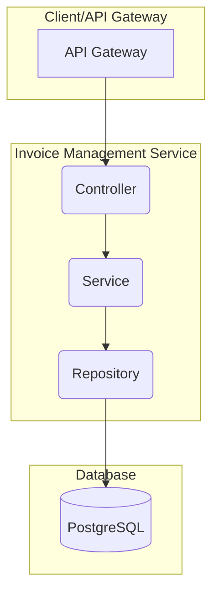

# Invoice Management Service

This service is responsible for managing all invoice-related operations, including creating, querying, and managing invoice data within a microservice ecosystem.

## Overview

**Invoice Management Service** is a microservice built with **.NET 8** and **Entity Framework Core**. Its primary responsibilities include:
- **Creating new invoices**
- **Querying invoice information** (by ID or by group)
- **Managing invoice data and status**

This service interacts with other services and connects to a **PostgreSQL** database for data persistence.

## Architecture

The service follows a clean, layered architecture pattern:



1.  **Controller Layer (`/Controllers`)**: Handles HTTP requests, validates input, and invokes methods in the Service Layer.
2.  **Service Layer (`/Services`)**: Contains the core business logic of the application. Processes data, performs calculations, and interacts with the Repository Layer.
3.  **Repository Layer (`/Repositories`)**: Responsible for data access, utilizing Entity Framework Core to interact with the database.

### Technology Stack

- **Language:** C# (.NET 8)
- **Framework:** ASP.NET Core Web API
- **Data Access:** Entity Framework Core 8
- **Database:** PostgreSQL
- **API Documentation:** Swagger (OpenAPI)
- **Build Tool:** dotnet CLI

## Main API Endpoints

| Method     | Endpoint                | Description                        |
|------------|-------------------------|------------------------------------|
| `POST`     | `/api/invoice`          | Create a new invoice               |
| `GET`      | `/api/invoice/{id}`     | Retrieve invoice details by ID     |

> **Note:** Listing invoices by group or other advanced queries can be extended via the service layer, but are not currently exposed as public endpoints in the controller.

## Data Models

### InvoiceDto
```csharp
public class InvoiceDto
{
    public Guid? Id { get; set; }
    public List<ItemDto>? Items { get; set; }
    public string? InvoiceNumber { get; set; }
    public Guid? GroupId { get; set; }
    public string? Model { get; set; }
    public string? Address { get; set; }
    public string? FileName { get; set; }
    public string? StoreName { get; set; }
    public Status Status { get; set; }
    public Guid? ApprovedBy { get; set; }
    public Guid? SubmittedBy { get; set; }
    public DateTime? CreatedDate { get; set; }
    public DateTime? UpdatedAt { get; set; }
    public decimal? TotalAmount { get; set; }
    public string? ImageUrl { get; set; }
}
```

### ItemDto
```csharp
public class ItemDto
{
    public Guid? Id { get; set; }
    public string? Item { get; set; }
    public decimal? Price { get; set; }
    public int? Quantity { get; set; }
    public Guid? Invoice { get; set; }
}
```

## Installation and Setup Guide

### Prerequisites
- .NET 8 SDK or higher
- PostgreSQL running instance

### Setup Steps

1.  **Clone the repository:**
    ```bash
    git clone <your-repo-url>
    cd invoice-management-service
    ```

2.  **Configure database connection:**
    Update the connection string in `InvoiceManagementService.HttpApi/appsettings.json`:
    ```json
    "ConnectionStrings": {
      "DefaultConnection": "Host=localhost;Port=5432;Database=your_invoice_db;Username=your_username;Password=your_password"
    }
    ```

3.  **Apply database migrations:**
    ```bash
    dotnet ef database update --project InvoiceManagementService.Infrastructure
    ```

4.  **Build and run the application:**
    ```bash
    dotnet run --project InvoiceManagementService.HttpApi
    ```
    The service will start at `http://localhost:8503` (or the configured port).

5.  **API Documentation:**
    - Swagger UI is available at `/swagger` when running in development mode.
